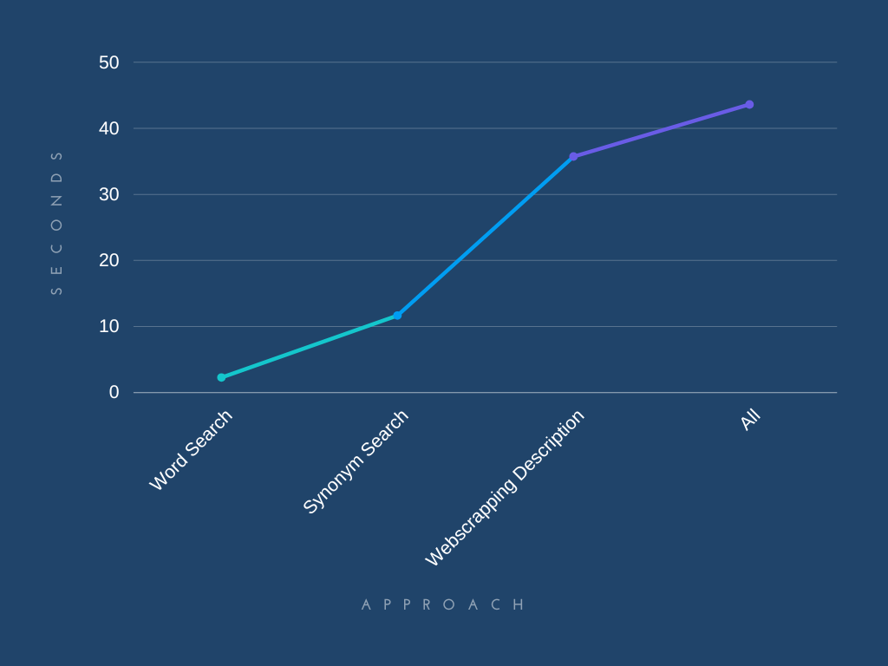

# spoonshot_app


## Q1 
### Run Instructions 

```
cd Q1/
python compare.py
```
Install all required packages using 

```
pip install requirements.txt
```

### Explanation of approaches used.

1. Used nltk library to find most common words in the article, calcuated the their frequency.
2. Matching the words in the ingridient list to the words in the most common words list.
3. Synonyms of the words in the ingridient list and looked for them in the most common words list.
4. WebScrapping, webscrapped data from [Dictionary.com](www.dictonary.com).
5. Also impleted bert on the article given to pick out relevant keywords, however that was dropped since words were very limited.
6. For comparing strings used `nltk.edit_distance()` to adjust for words like ***vegetable*** and ***vegetables***


### Output

The 3 models used require different amount of time, the graph has been plotted out below.





## The Output of the three codes are as follows. 

### Word Mathching

```
[['Vegan White Cake', '13%'],
 ['Vegan Semisweet Chocolate Chips', '13%'],
 ['Vegan Puff Pastry Sheet', '13%'],
 ['Vegan Marshmallow', '13%'],
 ['Vegan Chorizo', '13%'],
 ['Vegan Chicken Strips', '13%'],
 ['Vegan Carob Chips', '13%'],
 ['Chia Meal', '5%'],
 ['Munch Chocolate', '4%'],
 ['Organic Tartar Cream', '2%'],
 ['Organic Peruvian Groundcherry', '2%'],
 ['Organic Maize', '2%'],
 ['Campari Tomato', '1%'],
 ['Baby Abalone', '1%'],
 ['Vinegar', '0%'],
 ['Vegetable Stock', '0%'],
 ['Tamarind', '0%'],
 ['Strawberry Gelatin', '0%'],
 ['Snickers Spread', '0%'],
 ['Smokies Sausage', '0%'],
 ['SalmonTomato', '0%'],
 ['Pork Tripe', '0%'],
 ['Pork Lungs', '0%'],
 ['Pork Chump Chops', '0%'],
 ['Pickled Cauliflower', '0%'],
 ['Peanut Butter', '0%'],
 ['Orange Extract', '0%'],
 ['Murukku Packet', '0%'],
 ['Mulberry', '0%'],
 ['Muesli', '0%'],
 ['Mccormick Montreal Steak Seasoning', '0%'],
 ['Mango', '0%'],
 ['Hog Maw', '0%'],
 ['Giardiniera', '0%'],
 ['Crunch Bars', '0%'],
 ['Celery Soup', '0%'],
 ['Cardamom', '0%'],
 ['Cadbury Double Decker Chocolate Bar', '0%'],
 ['Arizona Seasoning', '0%'],
 ['Apple Cinnamon Granola', '0%'],
 ['Americano Coffee', '0%'],
 ['Ambrette Seed', '0%']]
process completed in:  2.362823009490967 seconds
```

### Synonyms 
```
[['Vegan Puff Pastry Sheet', '11%'],
 ['Vegan Semisweet Chocolate Chips', '11%'],
 ['Vegan Carob Chips', '10%'],
 ['Vegan White Cake', '10%'],
 ['Vegan Chicken Strips', '9%'],
 ['Vegan Marshmallow', '8%'],
 ['Vegan Chorizo', '8%'],
 ['Chia Meal', '7%'],
 ['Munch Chocolate', '5%'],
 ['Organic Tartar Cream', '3%'],
 ['Ambrette Seed', '3%'],
 ['Crunch Bars', '3%'],
 ['Hog Maw', '3%'],
 ['Arizona Seasoning', '3%'],
 ['Vegetable Stock', '2%'],
 ['Pork Chump Chops', '2%'],
 ['Organic Maize', '2%'],
 ['Organic Peruvian Groundcherry', '2%'],
 ['Baby Abalone', '2%'],
 ['Cadbury Double Decker Chocolate Bar', '2%'],
 ['Mccormick Montreal Steak Seasoning', '1%'],
 ['Campari Tomato', '1%'],
 ['Peanut Butter', '1%'],
 ['Celery Soup', '1%'],
 ['Americano Coffee', '1%'],
 ['Snickers Spread', '1%'],
 ['Pork Tripe', '1%'],
 ['Pork Lungs', '1%'],
 ['Orange Extract', '1%'],
 ['Strawberry Gelatin', '1%'],
 ['Vinegar', '0%'],
 ['Tamarind', '0%'],
 ['Smokies Sausage', '0%'],
 ['SalmonTomato', '0%'],
 ['Pickled Cauliflower', '0%'],
 ['Murukku Packet', '0%'],
 ['Mulberry', '0%'],
 ['Muesli', '0%'],
 ['Mango', '0%'],
 ['Giardiniera', '0%'],
 ['Cardamom', '0%'],
 ['Apple Cinnamon Granola', '0%']]
process completed in:  11.527866840362549 seconds
```
### Web Scrapping
```
[['Vegan Puff Pastry Sheet', '12%'],
 ['Chia Meal', '9%'],
 ['Vegan White Cake', '9%'],
 ['Vegan Semisweet Chocolate Chips', '9%'],
 ['Vegan Marshmallow', '9%'],
 ['Vegan Chorizo', '9%'],
 ['Vegan Chicken Strips', '9%'],
 ['Vegan Carob Chips', '9%'],
 ['Pork Tripe', '6%'],
 ['Pork Chump Chops', '6%'],
 ['Pork Lungs', '3%'],
 ['Mccormick Montreal Steak Seasoning', '3%'],
 ['Celery Soup', '3%'],
 ['Arizona Seasoning', '3%'],
 ['Apple Cinnamon Granola', '3%'],
 ['Munch Chocolate', '3%'],
 ['Vinegar', '0%'],
 ['Vegetable Stock', '0%'],
 ['Tamarind', '0%'],
 ['Strawberry Gelatin', '0%'],
 ['Snickers Spread', '0%'],
 ['Smokies Sausage', '0%'],
 ['SalmonTomato', '0%'],
 ['Pickled Cauliflower', '0%'],
 ['Peanut Butter', '0%'],
 ['Organic Tartar Cream', '0%'],
 ['Organic Peruvian Groundcherry', '0%'],
 ['Organic Maize', '0%'],
 ['Orange Extract', '0%'],
 ['Murukku Packet', '0%'],
 ['Mulberry', '0%'],
 ['Muesli', '0%'],
 ['Mango', '0%'],
 ['Hog Maw', '0%'],
 ['Giardiniera', '0%'],
 ['Crunch Bars', '0%'],
 ['Cardamom', '0%'],
 ['Campari Tomato', '0%'],
 ['Cadbury Double Decker Chocolate Bar', '0%'],
 ['Baby Abalone', '0%'],
 ['Americano Coffee', '0%'],
 ['Ambrette Seed', '0%']]
process completed in:  35.480502128601074 seconds
```


### All 
```
[['Vegan Puff Pastry Sheet', '11%'],
 ['Vegan Semisweet Chocolate Chips', '10%'],
 ['Vegan Carob Chips', '10%'],
 ['Vegan White Cake', '10%'],
 ['Vegan Chicken Strips', '9%'],
 ['Vegan Marshmallow', '8%'],
 ['Vegan Chorizo', '8%'],
 ['Chia Meal', '8%'],
 ['Munch Chocolate', '5%'],
 ['Organic Tartar Cream', '3%'],
 ['Pork Chump Chops', '3%'],
 ['Ambrette Seed', '3%'],
 ['Crunch Bars', '3%'],
 ['Arizona Seasoning', '3%'],
 ['Hog Maw', '2%'],
 ['Vegetable Stock', '2%'],
 ['Mccormick Montreal Steak Seasoning', '2%'],
 ['Pork Tripe', '2%'],
 ['Organic Maize', '2%'],
 ['Organic Peruvian Groundcherry', '1%'],
 ['Baby Abalone', '1%'],
 ['Cadbury Double Decker Chocolate Bar', '1%'],
 ['Celery Soup', '1%'],
 ['Pork Lungs', '1%'],
 ['Apple Cinnamon Granola', '1%'],
 ['Campari Tomato', '1%'],
 ['Peanut Butter', '1%'],
 ['Americano Coffee', '1%'],
 ['Snickers Spread', '1%'],
 ['Orange Extract', '1%'],
 ['Strawberry Gelatin', '1%'],
 ['Vinegar', '0%'],
 ['Tamarind', '0%'],
 ['Smokies Sausage', '0%'],
 ['SalmonTomato', '0%'],
 ['Pickled Cauliflower', '0%'],
 ['Murukku Packet', '0%'],
 ['Mulberry', '0%'],
 ['Muesli', '0%'],
 ['Mango', '0%'],
 ['Giardiniera', '0%'],
 ['Cardamom', '0%']]
process completed in:  43.580971002578735 seconds
```


## Q2 
### Run Instructions 

Used 2 different algorithms for solving the problem both of them are **O(n)** 

1. It goes through array twice once forward and once backward and multiplies all prev products with the current element to get a product from both sides.

2. It goes through the array once and calculates the product and checks for number of 0's.

> Run time for 1 is slighly less than 2, but I prefer 2 over one since its cleaner and uses a better algorithm for larger datasets.

